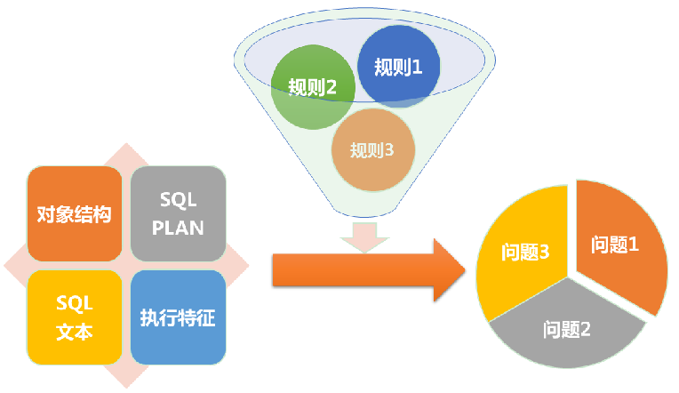

# Themis 
### 功能概述   

Themis，是宜信公司DBA团队开发的一款数据库审核产品。可帮助DBA、开发人员快速发现数据库中质量问题，提升工作效率。

1. 平台的核心能力旨在快速发现数据库设计、SQL质量问题。
2. 平台只做事后审核，自主优化部分放在二期实现。亦可在项目设计阶段引入，起到一部分事前审核的作用。
3. 通过WEB界面完成全部工作，主要使用者是DBA和有一定数据库基础的研发人员。
4. 可针对某个用户审核，可审核包括数据结构、SQL文本、SQL执行特征、SQL执行计划等多个维度。
5. 审核结果通过WEB页面或导出文件的形式提供。
6. 平台支持主流的Oracle、MySQL数据库，其他数据库放在二期实现。
7. 尽量提供灵活定制的能力，便于日后扩展功能。

#### 1. 支持数据库    
* Oracle（10g及以上)）
* MySQL（5.6及以上）

#### 2. 审核维度     
* 数据库结果（对象）   
指数据库对象，常见的表、分区、索引、视图、触发器等。
* SQL文本（语句）    
指SQL语句文本本身。
* SQL执行计划    
指数据库中SQL的执行计划。
* SQL执行特征  
指语句在数据库上的真实执行情况。
### 实现原理   
整个平台的基本实现原理很简单，就是将我们的审核对象（目前支持四种），通过规则集进行筛选。符合规则的审核对象，都是疑似有问题的。平台会将这些问题及关联信息提供出来，供人工甄别使用。由此可见，平台的功能强大与否，主要取决于规则集的丰富程度。平台也提供了部分扩展能力，方便扩展规则集。
   

### 架构总览   

   
图中主要分为四大块，数据采集、规则解析、任务导出和web管理，存储主要使用mongodb和mysql。mysql主要用来存储pt-query-digest采集的数据，其他的数据，如oracle的采集结果，规则的初始化，任务的生成，解析的结果等都存到mongodb里。 
