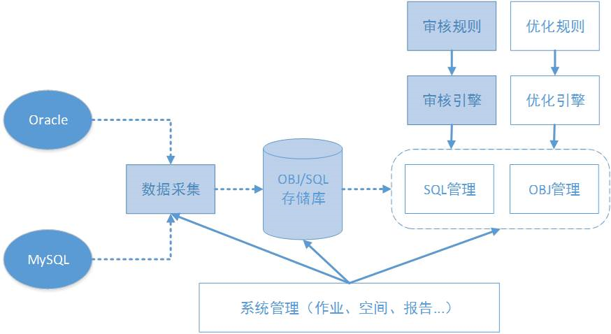

## Themis 

### 架构总览   
   
图中主要分为四大块，数据采集、规则解析、任务导出和web管理，存储主要使用mongodb和mysql。mysql主要用来存储pt-query-digest采集的数据，其他的数据，如oracle的采集结果，规则的初始化，任务的生成，解析的结果等都存到mongodb里。 

### 采集数据： 
#### mysql部分： 
pt-query-digest使用 
1. 可以将慢日志集中到一个地方，再集中入库 
2. 也可以在每台mysql机器上安装pt-query-digest,再将解析结果推送到存储机器上 
本平台采用第二种方案 
首先安装mysql 
从https://www.percona.com/get/pt-query-digest下载并安装pt-query-digest，如果缺少依赖使用yum安装
使用scirpt/pt_query_digest.sql初始化表结构,不要使用默认的表结构 
在目标机器上配置好pt-query-digest.sh脚本，主要是配置存储解析结果的mysql机器的帐号，密码，机器ip，端口号，以及慢日志的位置等。 
运行pt-query-digest.sh脚本开始搜集mysql慢查询数据，后面可以将其加入定时任务，按固定时间段搜集。 

#### oracle部分： 
下载mongodb，安装mongodb，用来存储规则和抓取的数据，执行的任务等 
配置mongodb具有eval执行权限，参考：http://www.cnblogs.com/viewcozy/p/4683666.html
在settings.py文件中配置好ORACLE_ACCOUNT，将要采集数据的目标机器的ip，端口，帐号，密码，sid等配置好，并在目标机器上开通帐号权限。 
连接oracle目标库统一采用sid的方式 
使用 python command.py -m capture -t data/capture_obj.json 运行采集对象命令  
使用 python command.py -m capture -t data/capture_other.json 采集其他信息 
将这两部分分开主要是因为，这两个采集模块比较耗时，将来可以放在celery的不同队列里 
-t指定任务类型，分为四部分capture，analysis，export，web 
-c指定配置文件，在data目录下有相应的模版 
找一台线下的机器，看看线下有哪些库需要做审核，进行一些相应的配置，搭建环境，记录文档 
