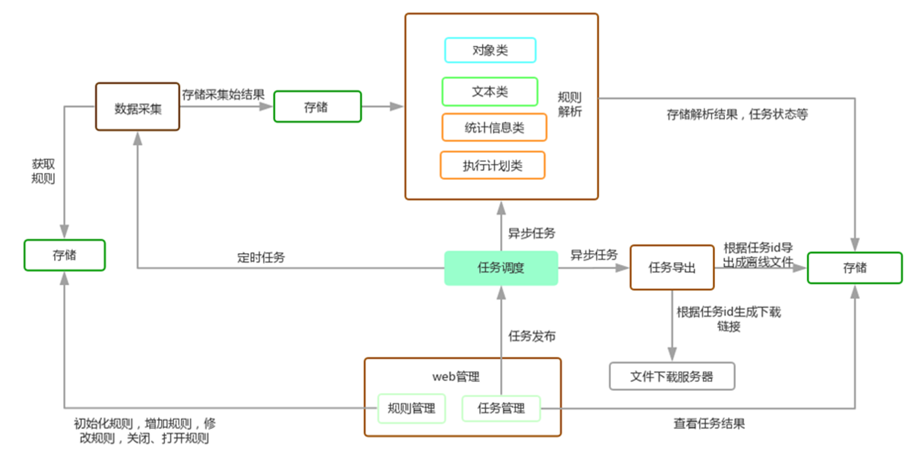

# Themis 
### 功能概述   

Themis，是宜信公司DBA团队开发的一款数据库审核产品。可帮助DBA、开发人员快速发现数据库中质量问题，提升工作效率。

1. 平台的核心能力旨在快速发现数据库设计、SQL质量问题。
2. 平台只做事后审核，自主优化部分放在二期实现。亦可在项目设计阶段引入，起到一部分事前审核的作用。
3. 通过WEB界面完成全部工作，主要使用者是DBA和有一定数据库基础的研发人员。
4. 可针对某个用户审核，可审核包括数据结构、SQL文本、SQL执行特征、SQL执行计划等多个维度。
5. 审核结果通过WEB页面或导出文件的形式提供。
6. 平台支持主流的Oracle、MySQL数据库，其他数据库放在二期实现。
7. 尽量提供灵活定制的能力，便于日后扩展功能。

#### 1. 支持数据库    
* Oracle（10g及以上)）
* MySQL（5.6及以上）

#### 2. 审核维度     
* 数据库结果（对象）   
指数据库对象，常见的表、分区、索引、视图、触发器等。
* SQL文本（语句）    
指SQL语句文本本身。
* SQL执行计划    
指数据库中SQL的执行计划。
* SQL执行特征  
指语句在数据库上的真实执行情况。

### 实现原理   
整个平台的基本实现原理很简单，就是将我们的审核对象（目前支持四种），通过规则集进行筛选。符合规则的审核对象，都是疑似有问题的。平台会将这些问题及关联信息提供出来，供人工甄别使用。由此可见，平台的功能强大与否，主要取决于规则集的丰富程度。平台也提供了部分扩展能力，方便扩展规则集。

   

### 平台架构   

   
图中的方框部分，为平台的主要模块。底色不同的模块，表示当前的进度状态不同。虚线代表数据流，实线代表控制流。其核心为这几个模块：

1. 数据采集模块。它是负责从数据源抓取审核需要的基础数据。目前支持从Oracle、MySQL抓取。
2. OBJ/SQL存储库。这是系统的共同存储部分，采集的数据和处理过程中的中间数据、结果数据都保存在这里。其核心数据分为对象类和SQL类。物理是采用的MongoDB。
3. 核心管理模块。图中右侧虚线部分包含的两个模块：SQL管理和OBJ管理就是这部分。它主要是完成对象的全生命周期管理。目前只做了简单的对象过滤功能，因此还是白色底色，核心的功能尚未完成。
3. 审核规则和审核引擎模块。这部分是平台一期的核心组件。审核规则模块是完成规则的定义、配置工作。审核引擎模块是完成具体规则的审核执行部分。
4. 优化规则和优化引擎模块。这部分是平台二期的核心组件。目前尚未开发，因此为白色底色。
5. 系统管理模块。这部分是完成平台基础功能，例如任务调度、空间管理、审核报告生成、导出等功能。

### 操作流程

   
从处理流程的角度，看看平台的整体处理过程。

##### 规则管理   
* 初始化规则。平台本身内置了很多规则，在这一过程中到导入到配置库中。  
* 新增规则。平台本身提供了一定的扩展能力，可以依据规范新增一条规则。  
* 修改规则。可以根据自身情况开启或关闭规则。对于每条规则，还内置了一些参数，也可在此处修改  。此外，针对违反规则的情况，还可以设置扣分方法（例如违反一次扣几分、最多可扣几分）等。

 *规则本身及相关参数、配置信息等都会存储在配置库中。*

##### 任务管理    
这是后台管理的一个部分，主要完成与任务相关的工作。系统中的大多数交互都是通过作业异步完成的。其后台是通过celery+flower实现的。
##### 数据采集    
这部分是通过任务调度定时出发采集作业完成，也有少量部分是实时查询线上库完成的。采集的结果保存在数据库中，供后续分析部分调用。
##### 规则解析    
这部分是由用户通过界面触发，任务调度模块会启动一个后台异步任务完成解析工作。之所以设计为异步完成，主要是审核工作可能时间较长（特别是选择审核类别较多、审核对象很多、开启的审核规则较多）的情况。审核结果会保存在数据库中。
##### 任务查看、导出    
在用户发起审核任务后，可在此部分查看进度（处于审核中、还是审核完成）。当审核完成后，可选择审核任务，浏览审核结果或选择导出都可以。如果是选择导出的话，会生成异步后台作业生成文件，放置在下载服务器上。

